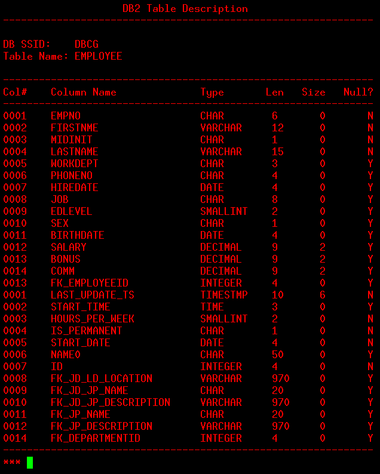

# MTM2019 Part 3 Challenge 15

My entry for IBM's Master the Mainframe 2019 Part 3 Challenge 15.
http://mtm2019.mybluemix.net/part_three/part_three_ch15.html


As far as the code goes, its probably very novice.
I didn't get much time to sit down and learn as much REXX as I originally intended. I included the MTM2019 source for parts 2 and 3 for future reference.


## My Entry
I made 2 simple reports to mess aroud with REXX and learn more about z/OS 
while fulfilling the challenge requirements.


## Report 1 (JOBID)
A very basic edit of the template to find occurrences of a specific
job identifier in SYSLOG messages.



## Report 2
A simple report for displaying information about this system's DB2 instance using a few DB2 system views.


## Commands (ISPF Shell)
* Allocate needed partitioned data sets for challenge ```tso submit 'zos.public.jcl(p3ch15)'```
* Run report program interactively ```ex ch15(get)```
* Submit JCL for report program ```tso submit jcl(REXXJCL)```
* Submit and view job ```tso submit jcl(REXXJCL); =sd ; st```
* Syntax highlighting for REXX (Editor) -> ```hilite rexx```

## Challenge Description
Storyline - The role you are now playing is a role of an experienced z/OS technician. Your assignment as an experienced z/OS technician is to help a newbie become familiar with the z/OS environment. How you are going to assist a newbie become familiar with z/OS is by creating customized reports that read and format SYSLOG messages.


The challenge is for you to enhance a system utility which generates point-in-time system activity reports. The system utility uses REXX and the SDSF interfaces to generate reports. Consider all SDSF Menu selections as the SDSF interfaces.

You already created 2 reports -
* Challenge 13 reported on the relationship between real memory, cpu consumption, and number of active workloads
* Challenge 14 reported on all occurrences of a specific string found in the system log (SYSLOG)

Reports can be from any of the SDSF interfaces.

**At least 1 report you write must demonstrate ability to parse SYSLOG records.**

A report on all occurrences of a message ID is provided as a guide for additional reports demonstrating your ability to parse SYSLOG records and your knowledge of z/OS messages in the SYSLOG.


## Judging Criteria
Your ch15(get) will be executed to view the various reports.

The final challenge has no correct or incorrect answer.

The final challenge is a matter of exercising technical creativity to distinguish your ideas and work from the other contestants. You are given a few ideas with sample Rexx code as the basis for applying creativity.

You have the freedom to do what you want. The judges are looking for technical acumen applied to z/OS. Impress the judges with your best reports that show your acquired z/OS knowledge. The REXX code template provided is a good start. You are not required to use the REXX code template. If you choose to not use the REXX code templates, then execution of ch15(get) needs to guide the judges what action must be taken to review your work.


## References
* 3720 terminal emulator - http://x3270.bgp.nu/
* MVS System Messages - https://www-01.ibm.com/servers/resourcelink/svc00100.nsf/pages/zOSV2R3sa380668/$file/ieam100_v2r3.pdf
* System Panel (SYS) - https://www.ibm.com/support/knowledgecenter/en/SSLTBW_2.3.0/com.ibm.zos.v2r3.isfa600/isfa600ug_isfjvsys.htm
* Harcopy log messages JES2 System - https://www.ibm.com/support/knowledgecenter/SSLTBW_2.3.0/com.ibm.zos.v2r3.ieam100/iea3m1_Messages_sent_to_hardcopy_log_in_JES2_system.htm
* Using REXX with DB2 https://www.youtube.com/watch?v=r0Le6JuuS4c
